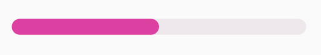

# RadiusProgressView
圆角自定义，可自定义原角大小；  
进度颜色和进度值自定义；  
# 预览

# 资源
|名字|资源|
|-|-|
|AAR|[radius_progress_view.aar](https://github.com/RelinRan/RadiusProgressView/blob/master/radius_progress_view.aar)|
|Gitee|[RadiusProgressView](https://gitee.com/relin/RadiusProgressView)|
|GitHub |[RadiusProgressView](https://github.com/RelinRan/RadiusProgressView)|
# Maven
1.build.grade | setting.grade
```
repositories {
	...
	maven { url 'https://jitpack.io' }
}
```
2./app/build.grade
```
dependencies {
	implementation 'com.github.RelinRan:RadiusProgressView:2022.6.20.1'
}
```
# xml
~~~
    <com.androidx.wiget.RadiusProgressView
        android:layout_width="match_parent"
        android:layout_height="20dp"
        android:max="100"
        android:progress="50"
        android:radius="10dp"
        app:progressColor="#DC40A1"
        app:solidColor="#EEE8EC" />
~~~
# attrs.xml
~~~
    <attr name="progressColor" format="color|reference" />
    <attr name="solidColor" format="color|reference" />
    <declare-styleable name="RadiusProgressView">
        <attr name="solidColor" />
        <attr name="progressColor" />
        <attr name="android:progress" />
        <attr name="android:max" />
        <attr name="android:radius" />
    </declare-styleable>
~~~
